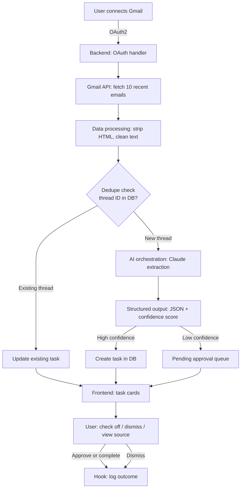

# Email-to-Task Agent

An agent that scans a Gmail inbox, extracts action items from emails, and turns them into a de-duplicated, approvable task list — so nothing gets missed or double-logged across long threads.

## Architecture

**Flow summary:** the backend authenticates via OAuth, pulls the most recent emails, cleans them, checks whether each thread already has a task (to avoid duplicates), and only then sends new content to the AI model for extraction. Extractions above a confidence threshold become tasks directly; low-confidence ones wait in an approval queue. The frontend renders both as cards, and every user action (approve, dismiss, complete) is logged.

## Tech stack

| Component | Description |
|---|---|
| **Backend** — Django + DRF | Python web framework for the API, OAuth token storage, and task/thread database |
| **Frontend** — React (Vite) | Dashboard for viewing tasks and approving/rejecting agent suggestions |
| **Claude API** | Performs the extraction — reads cleaned email text, returns structured JSON with action items and a confidence score |
| **Local llama3 (Ollama)** | Cheap first-pass filter — flags whether an email likely contains an action item before deciding whether to send it to Claude |
| **ChromaDB** | Vector store for thread-similarity checks — catches emails related to an existing task even without a shared thread ID |
| **Relational DB** | Source of truth for tasks, thread metadata, and status |
| **MCP server** | Exposes task operations (create, update, get status) as tools so any MCP-aware client can interact with the tracker |
| **Gmail API (OAuth2)** | Data source — fetches emails and thread context from the connected inbox |
| **pytest** | Backend/agent test suite |
| **Jest / Vitest + React Testing Library** | Frontend test suite |

## Model selection rationale

The project uses two LLM providers, each matched to a different difficulty level of task:

- **Claude** handles the actual extraction step. Pulling structured action items out of messy, multi-message email threads rewards strong instruction-following and reliable JSON output — this is where a frontier model's reliability shows up as fewer parsing failures and fewer hallucinated fields.
- **Local llama3 (via Ollama)** handles triage, not extraction. Most inbox emails are newsletters or automated notices with no action item at all. A cheap local yes/no classification pass filters these out before they reach the Claude API, cutting unnecessary calls without needing extraction-grade reasoning.

The split is deliberate: the expensive, capable model is reserved for the precise task (extraction), and the cheap, fast model is used for coarse triage — not the reverse. Routing it the other way would mean paying for Claude on every newsletter and getting weaker extraction quality from llama3 on the emails that actually matter.

**Known trade-off:** running a local model adds infrastructure complexity (managing the Ollama process) for a cost saving that only becomes meaningful at a scale beyond a 10-email sandbox demo. It's included to satisfy the multi-provider requirement and because it reflects a real production pattern, not because it produces a dramatic cost difference at demo scale.

## Memory design

Two separate stores are used because they answer different questions:

- **Relational DB** — exact lookups: does a task exist, what's its status. Needs transactional guarantees for create/update.
- **ChromaDB** — approximate similarity: does a new email relate to an existing thread even without a shared thread ID. The MVP's dedupe check (thread ID match) doesn't need this; it becomes useful once similarity-based matching is added on top.
